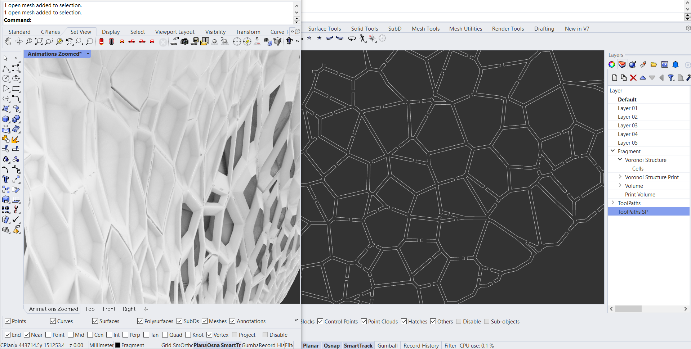

# Continuous Toolpath generator for cellular structures
⚠️ Documentation still under development
[Checkout our documentation website for a more complete explanation](https://robotic-building-tu-delft.github.io/Continuous-Toolpath-Generator/)
## Introduction
This workflow takes a geometry in the form of a mesh and generates a continuous toolpath.You an can find an example of a generated:

This workflow is based on Rhino > 7 and Grasshopper.

## How it works
An initial voronoi structure is provided. This geometry can be replaced with custom ones. The requirements of this geometry are:
- Cellular structure
- Generated considering printer requirements (max. overhang, level of printable detail etc.; also see: http://cs.roboticbuilding.eu/index.php/2021W3:Online)
- Geometry needs to be positioned with the Z-axis as the print direction
- Geometry needs to be split in print fragments if necessary to create a flat section to be positioned at the printing bed
- Cells are individual meshes
- Can contain closed as well as open cells
- Meshes describing the cells should be placed in the layer: Fragment::Voronoi Structure::Cells
- A bounding box (as a mesh) needs to be draw around the geometry in xyz orientation in layer: Fragment::Print Volume

//Briefly describe what the model, and more importanly the Grashopper part does for the user
These files generate a single continuous toolpath from a 3D Voronoi structure with the aim of 3D printing.

## Prerequisites
- The scripts are made in Rhino 7 and Grasshopper
- Required Grasshopper Plugins:
  - Anemone
  - Pufferfish
  - Human
  - Kangaroo 0.0.9.9
  - EleFront
  - ShortestWalk.gh
  - Clipper

## Usage
The process consists of a sequence of scripts which need to be run and baked in this order:

- `toolpaths.gh`
- `continuous_toolpaths.gh`

//The main geometry is in Toolpaths.3dm. After baking the curves in Toolpaths.gh the .3dm file becomes too large. We'll need to find a proper strategy for this.

