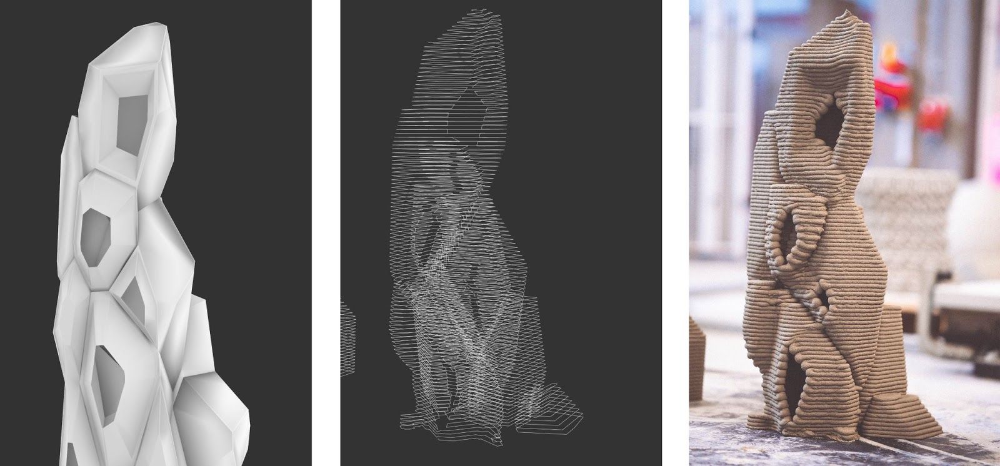
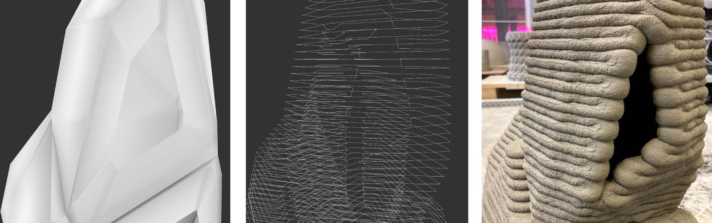

# Continuous Toolpath generator for cellular structures

⚠️ Documentation website still under development
[Checkout our documentation website for a more complete explanation](https://robotic-building-tu-delft.github.io/Continuous-Toolpath-Generator/)

A series of grasshopper scripts to generate GCode for the 3D printing of cellular structures. In order to generate [GCode ](https://en.wikipedia.org/wiki/G-code). The workflow consists of 3 main steps: 
- **1**. Generate continuous tool path curves per 3D printer layer according to the selection of certain 3D printing parameters and the cellular structure 3D model.
- **2**. Generate a continuous tool path that connects the isolated curves in te previous step. 
- **3**. Generate the GCode based on specific 3D printing settings and the continuous tool path geometry.

//Briefly describe what the model, and more importanly the Grashopper part does for the user
These files generate a single continuous toolpath from a 3D Voronoi structure with the aim of 3D printing.

## Prerequisites
- The scripts are made in Rhino 7 and Grasshopper
- Required Grasshopper Plugins:
  - Anemone
  - Pufferfish
  - Human
  - Kangaroo 0.0.9.9
  - EleFront
  - ShortestWalk.gh
  - Clipper

