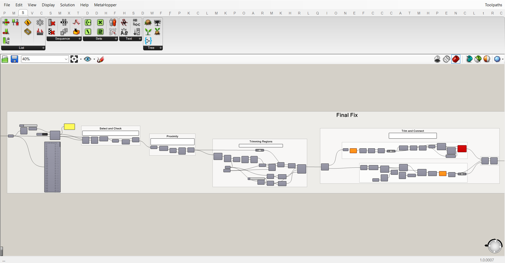

# Continuous Toolpath generator for cellular structures
## Introduction
This workflow takes a geometry in the form of a mesh and generates a continuous toolpath.You an can find an example of a generated [toolpath here]().

This workflow is based on Rhino > 7 and Grasshopper.

## How it works
An initial voronoi structure is provided. This geometry can be replaced with custom ones. The requirements of this geometry are:
- Cellular structure
- Generated considering printer requirements (max. overhang, level of printable detail etc.; also see: http://cs.roboticbuilding.eu/index.php/2021W3:Online)
- Geometry needs to be positioned with the Z-axis as the print direction
- Geometry needs to be split in print fragments if necessary to create a flat section to be positioned at the printing bed
- Cells are individual meshes
- Can contain closed as well as open cells
- Meshes describing the cells should be placed in the layer: Fragment::Voronoi Structure::Cells
- A bounding box (as a mesh) needs to be draw around the geometry in xyz orientation in layer: Fragment::Print Volume

//Briefly describe what the model, and more importanly the Grashopper part does for the user
These files generate a single continuous toolpath from a 3D Voronoi structure with the aim of 3D printing.

## Prerequisites
- The scripts are made in Rhino 7 and Grasshopper
- Required Grasshopper Plugins:
  - Anemone
  - Pufferfish
  - Human
  - Kangaroo 0.0.9.9
  - EleFront
  - ShortestWalk.gh
  - Clipper

## Usage
The process consists of a sequence of scripts which need to be run and baked in this order:
- `toolpaths.gh`
- `continuous_toolpaths.gh`
- 
//The main geometry is in Toolpaths.3dm. After baking the curves in Toolpaths.gh the .3dm file becomes too large. We'll need to find a proper strategy for this.

## Style
The scripts are organized according to certain principles considering the layout. 

Every script starts with a title and abstract:

Make sure the file is saved on this view when the file is public.

The components are organized and ordered in groups and subgroups. Every group has at least a title. If required it also contains a description. The smallest groups are titled in the group header, a level above that by a scribble with font-size 25, and the main groups with a scribble with font-size 50. All the wires which reduce the readability of the script are set to display 'Hidden'.

The descriptions are made in white panels.

Unresolved issues are appointed with red panels.

Changes are visualized by colored groups. Red groups are the old groups which can be deleted, green ones are added and yellow groups have been edited. Add a panel in the relating color to describe the changes.

If the changes have been made in a (Github-)branch, add a readme to summarize all the changes.
